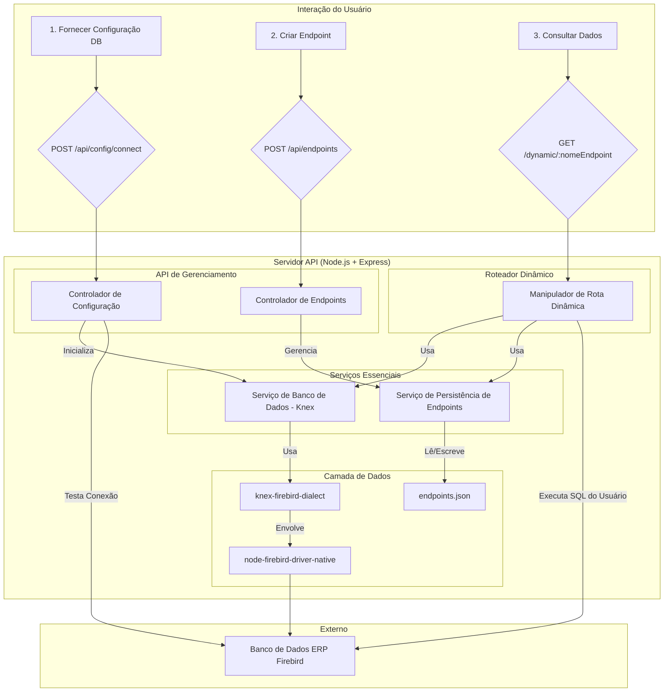

# Servidor API SQL Dinâmico para Firebird

## Visão Geral do Projeto

Este projeto implementa uma aplicação de servidor Node.js leve projetada para se conectar a um banco de dados Firebird (versões 3.0, 4.0 e 5.0 em ambientes Windows). Ele permite que os usuários criem e gerenciem dinamicamente endpoints de API HTTP personalizados que executam comandos SQL sob demanda e retornam os resultados em formato JSON.

O objetivo principal é fornecer uma camada flexível de API REST sobre um banco de dados Firebird, permitindo que aplicações externas (por exemplo, Postman, outros microsserviços ou frontends personalizados) interajam com o banco de dados usando consultas SQL definidas pelo usuário, expostas através de rotas HTTP simples.

## Funcionalidades

*   **Criação Dinâmica de Endpoints:** Defina endpoints de API personalizados com métodos HTTP especificados (GET, POST, PUT, DELETE) e consultas SQL associadas.
*   **Execução SQL Sob Demanda:** Execute comandos SQL definidos pelo usuário diretamente no banco de dados Firebird via requisições HTTP.
*   **Resposta JSON:** Retorna os resultados da consulta formatados como JSON.
*   **Conexão de Banco de Dados Configurável:** Os parâmetros de conexão do banco de dados (host, porta, usuário, senha, caminho do banco de dados) são fornecidos via API em tempo de execução, permitindo uma configuração de ambiente flexível sem alterações no código.
*   **Leve e Escalável:** Construído com Node.js, Express.js e Knex.js, utilizando pool de conexões para gerenciamento eficiente de recursos.
*   **Endpoints Dinâmicos:** As definições de endpoint são armazenadas em um arquivo JSON local, permitindo persistência e recarregamento dinâmico sem a necessidade de reiniciar o servidor.

## Arquitetura

O servidor adota uma arquitetura em camadas para separar as responsabilidades, tornando-o modular, manutenível e escalável.



*   **API de Gerenciamento:** Lida com a configuração da aplicação (conexão com o banco de dados) e o gerenciamento de endpoints dinâmicos (operações CRUD).
*   **Roteador Dinâmico:** Cria e atualiza automaticamente as rotas do Express.js com base nas definições armazenadas em [`endpoints.json`](endpoints.json). Cada rota dinâmica executa sua consulta SQL associada.
*   **Serviços Essenciais:** Encapsulam a lógica de negócios e as interações com recursos externos.
    *   [`Database Service`](src/services/databaseService.js): Gerencia a instância do Knex.js e seu pool de conexões com o banco de dados Firebird.
    *   [`Endpoint Persistence Service`](src/services/endpointService.js): Gerencia a leitura e escrita no arquivo `endpoints.json`.
*   **Camada de Dados:** Utiliza [`knex-firebird-dialect`](https://www.npmjs.com/package/knex-firebird-dialect) como um cliente Knex.js para Firebird, que por sua vez utiliza o [`node-firebird-driver-native`](https://www.npmjs.com/package/node-firebird-driver-native) para comunicação nativa com o banco de dados.

## Pré-requisitos

Antes de executar a aplicação, certifique-se de ter o seguinte instalado:

*   **Node.js:** Versão 18 ou superior.
*   **npm:** Gerenciador de Pacotes Node (vem com o Node.js).
*   **Biblioteca Cliente Firebird (fbclient):** Devido à arquitetura do `node-firebird-driver-native`, a biblioteca cliente nativa do Firebird (`fbclient.dll` no Windows) deve estar instalada e acessível no PATH do seu sistema.
    *   **Windows:** Baixe e execute o instalador oficial .exe do Firebird. Durante a instalação, selecione a opção "CLIENT ONLY". O instalador geralmente cuida da configuração do PATH.
*   **Ferramentas de Construção C++ do Visual Studio (para Windows):** O `node-firebird-driver-native` requer compilação nativa. Você precisa instalar a carga de trabalho "Desenvolvimento para desktop com C++" através do Instalador do Visual Studio.

## Instalação

1.  **Clone o repositório (se aplicável) ou navegue até o diretório do projeto:**
    ```bash
    cd d:/Documentos/serverNodeFirebird
    ```

2.  **Instale as dependências:**
    ```bash
    npm install
    ```

## Configuração

A aplicação utiliza variáveis de ambiente para dados sensíveis e configurações dinâmicas. Crie um arquivo `.env` na raiz do seu diretório de projeto (`d:/Documentos/serverNodeFirebird`) com a seguinte estrutura:

```dotenv
# Configurações de Conexão do Banco de Dados (substitua pelos seus detalhes reais do Firebird)
DB_HOST=localhost
DB_PORT=3050
DB_USER=SYSDBA
DB_PASSWORD=masterkey
DB_DATABASE=C:/caminho/para/seu/banco/de/dados.fdb

# Configurações do Servidor
SERVER_PORT=3000
# NODE_ENV=production # Descomente para ambiente de produção
```

*   **`DB_HOST`**: O nome do host ou endereço IP do seu servidor Firebird.
*   **`DB_PORT`**: A porta na qual seu servidor Firebird está escutando (padrão é 3050).
*   **`DB_USER`**: Seu nome de usuário do banco de dados Firebird (ex: `SYSDBA`).
*   **`DB_PASSWORD`**: Sua senha do banco de dados Firebird (ex: `masterkey`).
*   **`DB_DATABASE`**: O **caminho completo** para o seu arquivo de banco de dados Firebird no servidor (ex: `C:/Firebird/data/MEU_ERP.FDB`). Para conexões remotas, certifique-se de que o caminho seja acessível pelo processo do servidor Firebird.
*   **`SERVER_PORT`**: A porta na qual o servidor API Node.js será executado (padrão é 3000).

## Executando a Aplicação

Para iniciar o servidor em modo de desenvolvimento (com `nodemon` para reinicializações automáticas ao salvar arquivos):

```bash
npm start
```

Você deverá ver uma saída similar a:

```
Server running on port 3000
Access health check at http://localhost:3000/health
Configure database at http://localhost:3000/api/config/connect
Manage endpoints at http://localhost:3000/api/endpoints
```

## Endpoints da API

O servidor expõe duas categorias principais de endpoints de API: **API de Gerenciamento** e **API Dinâmica**.

### 1. API de Gerenciamento (`/api`)

Esses endpoints são usados para configurar a conexão do banco de dados e gerenciar os endpoints SQL dinâmicos.

#### `POST /api/config/connect`

*   **Descrição:** Estabelece e testa a conexão com o banco de dados Firebird usando as credenciais fornecidas. Isso deve ser chamado com sucesso antes que os endpoints dinâmicos possam executar consultas.
*   **Corpo da Requisição (JSON):**
    ```json
    {
      "host": "seu_host_db",
      "port": 3050,
      "username": "seu_usuario_db",
      "password": "sua_senha_db",
      "database": "C:/caminho/para/seu/banco/de/dados.fdb"
    }
    ```
*   **Resposta (Sucesso - 200 OK):**
    ```json
    {
      "message": "Banco de dados conectado com sucesso.",
      "config": {
        "host": "seu_host_db",
        "port": 3050,
        "username": "seu_usuario_db",
        "database": "C:/caminho/para/seu/banco/de/dados.fdb",
        "lowercase_keys": true
      }
    }
    ```
*   **Resposta (Erro - 400/500):**
    ```json
    {
      "error": "Falha ao conectar ao banco de dados.",
      "details": "..."
    }
    ```

#### `GET /api/config/current`

*   **Descrição:** Recupera a configuração de conexão do banco de dados atualmente ativa (excluindo a senha sensível).
*   **Resposta (Sucesso - 200 OK):**
    ```json
    {
      "config": {
        "host": "seu_host_db",
        "port": 3050,
        "username": "seu_usuario_db",
        "database": "C:/caminho/para/seu/banco/de/dados.fdb",
        "lowercase_keys": true
      }
    }
    ```
*   **Resposta (Erro - 404 Not Found):**
    ```json
    {
      "message": "Configuração do banco de dados não definida."
    }
    ```

#### `POST /api/endpoints`

*   **Descrição:** Cria um novo endpoint de API dinâmico. O servidor registrará automaticamente uma nova rota em `/dynamic/:name`.
*   **Corpo da Requisição (JSON):**
    ```json
    {
      "name": "obtemProdutos",
      "method": "GET",
      "sql": "SELECT ID, NOME, PRECO FROM PRODUTOS"
    }
    ```
    *   `name`: (string, obrigatório) O nome único para o endpoint (ex: `obtemProdutos`). Isso fará parte da URL (`/dynamic/obtemProdutos`).
    *   `method`: (string, obrigatório) O método HTTP para o endpoint (ex: `GET`, `POST`, `PUT`, `DELETE`).
    *   `sql`: (string, obrigatório) A consulta SQL a ser executada quando este endpoint for chamado.
*   **Resposta (Sucesso - 201 Created):**
    ```json
    {
      "message": "Endpoint criado com sucesso.",
      "endpoint": {
        "id": "1678886400000",
        "name": "obtemProdutos",
        "method": "GET",
        "sql": "SELECT ID, NOME, PRECO FROM PRODUTOS"
      }
    }
    ```
*   **Resposta (Erro - 400/500):**
    ```json
    {
      "error": "Nome do endpoint, método e consulta SQL são obrigatórios.",
      "details": "..."
    }
    ```

#### `GET /api/endpoints`

*   **Descrição:** Recupera uma lista de todos os endpoints dinâmicos atualmente definidos.
*   **Resposta (Sucesso - 200 OK):**
    ```json
    [
      {
        "id": "1678886400000",
        "name": "obtemProdutos",
        "method": "GET",
        "sql": "SELECT ID, NOME, PRECO FROM PRODUTOS"
      },
      {
        "id": "1678886400001",
        "name": "totalVendas",
        "method": "GET",
        "sql": "SELECT SUM(VALOR) AS TOTAL FROM VENDAS"
      }
    ]
    ```

#### `DELETE /api/endpoints/:id`

*   **Descrição:** Exclui um endpoint de API dinâmico pelo seu ID único.
*   **Parâmetros da URL:**
    *   `id`: (string, obrigatório) O ID único do endpoint a ser excluído.
*   **Resposta (Sucesso - 200 OK):**
    ```json
    {
      "message": "Endpoint excluído com sucesso."
    }
    ```
*   **Resposta (Erro - 404 Not Found):**
    ```json
    {
      "error": "Endpoint não encontrado."
    }
    ```

### 2. API Dinâmica (`/dynamic`)

Estes são os endpoints definidos pelo usuário, criados através da API de Gerenciamento. O caminho e o método dependem de como foram configurados.

#### Exemplo: `GET /dynamic/obtemProdutos`

*   **Descrição:** Um exemplo de endpoint dinâmico configurado para buscar produtos.
*   **Método:** `GET` (conforme definido durante a criação)
*   **Caminho:** `/dynamic/:nomeEndpoint` (onde `:nomeEndpoint` é o `name` fornecido ao criar o endpoint).
*   **Resposta (Sucesso - 200 OK):**
    ```json
    [
      { "ID": 1, "NOME": "Laptop", "PRECO": 1200.00 },
      { "ID": 2, "NOME": "Mouse", "PRECO": 25.00 }
    ]
    ```
    (A estrutura do array JSON dependerá da consulta SQL executada.)
*   **Resposta (Erro - 500 Erro Interno do Servidor):**
    ```json
    {
      "error": "Falha ao executar a consulta SQL dinâmica.",
      "endpoint": "obtemProdutos",
      "details": "..."
    }
    ```

## Estrutura do Projeto

```
.
├── src/
│   ├── config/
│   │   └── index.js             # Carrega variáveis de ambiente para configurações de DB e servidor.
│   ├── controllers/
│   │   ├── configController.js    # Lida com a lógica da API para gerenciamento de conexão DB.
│   │   └── endpointController.js  # Lida com a lógica da API para CRUD de endpoints dinâmicos.
│   ├── routes/
│   │   ├── configRoutes.js        # Define as rotas Express para configuração do DB.
│   │   └── endpointRoutes.js      # Define as rotas Express para gerenciamento de endpoints dinâmicos.
│   ├── services/
│   │   ├── databaseService.js     # Gerencia a instância do Knex.js e a conexão Firebird.
│   │   └── endpointService.js     # Lida com a persistência de endpoints dinâmicos para endpoints.json.
│   ├── dynamicRouter.js         # Cria dinamicamente rotas Express com base nos endpoints armazenados.
│   └── server.js                # Ponto de entrada principal da aplicação Express.
├── .env.example             # Exemplo de arquivo .env para configuração.
├── endpoints.json           # Armazena definições de endpoints dinâmicos (criado na primeira execução se não existir).
├── package.json             # Metadados e dependências do projeto.
├── package-lock.json        # Registra as versões exatas das dependências.
├── README.md                # Este arquivo de documentação.
└── .gitignore               # Especifica arquivos intencionalmente não rastreados a serem ignorados.
```

## Tratamento de Erros

A aplicação inclui um middleware de tratamento de erros centralizado em [`src/server.js`](src/server.js) para garantir respostas de erro consistentes. Em um ambiente de desenvolvimento (`NODE_ENV` não definido como `production`), rastreamentos de pilha detalhados são incluídos para facilitar a depuração.

## Contribuição

Sinta-se à vontade para fazer um fork do repositório, abrir issues ou enviar pull requests.

## Licença

Licença ISC.